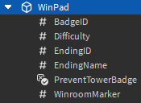
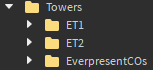
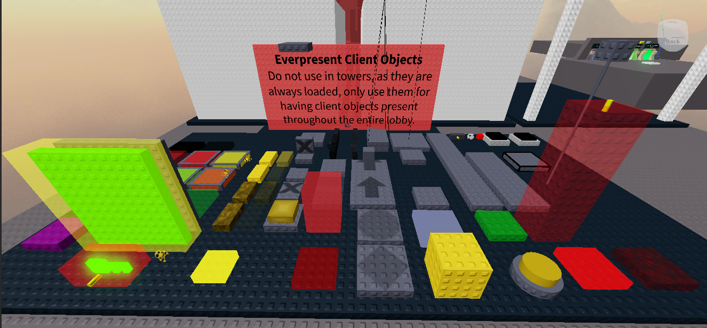

# Using the Kit

## Setting up the important stuff

If you obtained the kit through it’s original, uncopylocked place, or an official place file, everything should already be where they’re supposed to be.

### Adding a tower

Adding a tower is at the core of this kit, It's pretty much the whole reason one would use this kit. To add a tower, start by inserting a tower, or even a blank kit, into the workspace. After it is inserted, move it into the `Towers` folder.

Rename the tower to the acronym of the tower; Be reasonable, as it's acronym will be used as the tower's internal identifier, and will be shown next to the timer on the client's GUI.

The tower should be organized the same way any tower is normally organized. The kit folder should contain:

- The `Obby` folder which contains all of the normal, static parts. Most of which make up the gameplay of the tower.
- The `Frame` folder/model, which contains the parts that make up the frame of the tower. This functionally is exactly the same as the obby folder, but a distinction will be important in the future, as I plan on adding a low-detail mode[^1] to the kit in the future.
- The `ClientSidedObjects` folder contains all of the client objects for the tower. When the game loads, every tower’s `ClientSidedObjects` folder is moved into storage (`game.ServerStorage.TowerClientObjects`), and is served to a client whenever they load a tower.
  - Optionally, you may move this folder to the `TowerClientObjects` folder yourself in studio, just as long as the folder is renamed to be the same as the tower’s acronym.
  - The folder itself is optional too, the kit will function if this folder is removed completely, making it a true **“purist”**[^2] tower.


:::info

In this image, an example tower is shown appropriately inserted into the `Towers` folder. Because this tower is called "**Example Tower 1**", the folder is named after it's acronym, "**ET1**".

:::

After inserting the tower into the place, you must give it some properties to make it work with the MTK. Properties may be inserted in 2 ways: The first being adding an attribute to the tower folder, the second being adding a ValueBase (`BoolValue`, `StringValue`, `NumberValue`, etc) instance to the folder.

:::note

For convenience sake, **ValueBases** are used by default in the kit.

:::

Here are the following properties that must be added to the tower folder:

- A **BadgeID** `IntValue`. When the tower is beaten by the player, they will be awarded a badge, the value of this property being the ID of the badge awarded. If the value is 0, no badge will be awarded.
- A **Difficulty** `StringValue`. This will point to a difficulty defined in the Difficulties[^3] module. If it does not name an existing difficulty, a `default` difficulty will be used, which is heavily discouraged.
  - For now, any built-in difficulty works, those being: Impossible, Easy, Medium, Hard, Difficult, Challenging, Intense, Remorseless, Insane, Extreme, Terrifying, Catastrophic, Horrific, and Unreal.
- A **MinimumTime** `NumberValue`. This property describes how much time (in seconds) a player must be in a tower for a completion to be considered legitimate. If the tower is beaten before the timer passes this value, the player will be kicked for cheating.
- A **ProperName** `StringValue`. This property describes the proper name of the tower, as the name of the folder is merely the acronym. The proper name is usually used for win messages. For example: If i had a tower folder named `ToS`, a reasonable value for this property would be `Tower of Stress`.


This image depicts the folder structure of Example Tower 1 as shown earlier, but with the new properties added.

At this point, the tower has been fully implemented. It just needs a portal to be entered.

### Creating portals

Portals are the parts that load a tower when a player touches it, as well as teleporting them to the tower’s `SpawnLocation`. All portal parts must be put in the `Portals` folder in the `workspace` to work.

To create a portal, start by inserting a `BasePart` into the `Portals` folder. Then, add a `StringValue` to the portal part named `TowerPortal`. Alternatively, you can duplicate any of the portals included with the template place. Set the value of the `TowerPortal` string to the acronym of any tower, more accurately, the name of any folder in the `Towers` folder.


A bare minimum setup of the `Portals` folder, including 3 portals.

:::note

The parts in the folder does not actually matter.

:::

You can also choose to instead give a `TowerPortal` a `StringValue` named `LobbyTeleporter`. This will turn it into a server-sided teleporter. Set it’s value to the name of any part in the `Markers` folder, and touching it in-game will teleport the player to that marker.

### Adding anti-cheat checkpoints to a tower

Anti-cheat checkpoints are a new feature to the MTK that acts similarly to the checkpoints in JToH. They are invisible blocks never seen by the client, and the character must pass through them in order. Failure to do so will result in the player being kicked for completing the tower out of order.

:::info

Every tower’s checkpoints can be defined as a list of parts.

:::

This list is constructed from a folder, either `Checkpoints` inside the tower folder itself, or a folder named the same as the tower acronym inside the `TowerCheckpoints` folder inside `ServerStorage`. If the checkpoints folder is kept in the tower folder, you will be warned for doing so, as leaving anything in the workspace is at risk of being obtained by exploiters, with checkpoints being too important to be made easily visible. Therefore, keeping them stored inside of `ServerStorage` is much safer, as it’s secure, and never has a chance of replicating to the client.

:::warning

Every instance inside of the checkpoints folder must be named in order, with the very first checkpoint being named `1`, the second being named `2`, the third being named `3`, etc. Failure to do so will result in an error. Every instance must be also `BasePart`.

:::


The checkpoints folder as found in `ServerStorage`. ET2's checkpoints folder is expanded to show the parts inside it.

At the moment, checkpoint touch detection works by seeing if the character’s [pivot point](https://create.roblox.com/docs/studio/pivot-tools) is inside the _oriented bounding-box_ area of the part. This means that you can position and rotate the part as much as you want, but it will be treated like a box, regardless of it’s actual shape.

:::tip

Make sure the checkpoint parts are reasonably large, as the kit will only check if a player is inside a checkpoint every `0.25 seconds`. This rate can be changed in the `GameData.Config` module, specifically the `CheckpointInterval` property.

:::

### Building the lobby and setting up markers

Probably one of the most crucial part of your player’s experience is not just the towers, but the place the towers sit in itself. There’s not much important information to list in regards to building the lobby in this manual as that’s mostly going to be your responsibility. However there are some important things to consider:

- Keep things properly organized. There’s a folder in the `workspace` called `Lobby`, and anything related to the lobby should ideally be kept in this folder.
- Avoid use of physics constraints on the server-side. Any constraints, or special objects of any kind for that matter, should be made into client objects.

Aside from this, there’s the markers folder which is useful for placing markers of different kinds around the map. This includes spawn points, teleporter portal destinations, etc. To create a marker, simply create a part in the `Markers` folder, and name whatever you wish. Naming markers certain things will give it special functionality, a list of markers and their functions are listed below:

- **SpawnLocation** is a SpawnLocation part that acts as the default spawn, and should ideally be where all players in the `Start` team spawn.
- **WinroomSpawn** is also a SpawnLocation, but is specifically attributed to the `Winners` team. It’s also where all win pads will teleport the player by default unless specified otherwise.
- **LobbyTP** is a server-sided teleporter part. When a player touches it, they will be teleported to the `Start` team’s SpawnLocation, and will be re-assigned to the `Start` team if they aren’t a member already. This should ideally be used in sky lobbies and winrooms.

Any marker without a name listed above doesn’t get any special functionality. They will just be plain parts that don’t do anything on their own. The reason you would need to create parts like these is usually to act as destinations for teleporters. Lobby portals will search the `Markers` folder for a part named the value of it’s `LobbyTeleporter` value. Win pads on the other hand can be optionally configured to teleport to a marker of a specific name instead of the `WinroomSpawn`.

## Setting up other parts of the kit

You may be finished with the important parts of the kit, but there’s still many more features in the kit that are you are free to use or leave alone. This part of the manual talks more about those features.

### Configuration modules

There exist many configuration modules throughout the kit that each serve their own purpose. Most properties inside these modules are documented inside of the modules themselves via comments. Otherwise, they are touched on in other parts of the manual. A list of all of them can be found below:

- `ServerScriptService.GameData.Config` – Settings for the server-side of the kit. Contains most general-purpose settings related to how the game should work.
- `ServerScriptService.GameData.Difficulties` – Contains every difficulty in the game.
- `ServerScriptService.GameData.KickMessages` – Nothing complex, just a list of messages that are randomly picked when the anti-cheat kicks a player from the game. All instances of `{Player}` will be replaced with the player’s username.
- `ServerScriptService.RealmData.TowerRushes` – Contains every tower rush in this realm.

### Adding a tower rush

To start, open up the `RealmData` folder in `ServerStorage`, and open up the module in the folder named `TowerRushes`. This module contains the information for every tower rush in the realm. In order to add your own tower rush, duplicate the following code, and change the properties as explained below it:

```lua
ExampleTowerRush = {
	BadgeID = 0,
	Title = "Example Tower Rush",
	Difficulty = "Medium",
	WinroomMarker = "",
	Towers = {
		"ET1",
		"ET2",
	}
},
```

- `ExampleTowerRush` is the ID of the tower rush, change it to something sensible, like **Ring5TowerRush**, or **SecretTowerGauntlet**, etc.
- The `BadgeID` property serves the same function it does for towers. It is the ID of the badge to be awarded upon completion of the tower rush, if set to 0, no badge is awarded.
- The `Title` property is the proper, displayed name of the tower rush.
- The `Difficulty` property serves the same function it does for towers. It references the name of a difficulty, and should be representative of the tower rush’s overall difficulty
- The `WinroomMarker` property lets you choose where the player is teleported upon completion of the tower rush. If set to a blank string, it will simply teleport the player to the default win room; In other words, the `WinroomSpawn` part in the `Workspace.Markers` folder. Otherwise, it should be the name of any part in the markers folder.
- Finally, there is the `Towers` property. It contains an array of towers (described via their acronyms) in order of appearance. Every item in this array should be the name of one of the towers inside of the Workspace.Towers folder surrounded by double-quotation marks.

::::note

All tower rushes must have a unique ID for reference later, and must never conflict with another. Ideally they should be formatted in PascalCase, or be the acronym of the tower rush’s title, but it doesn’t truly matter.

:::warning

In-case you are not familiar with Luau syntax, any item in a table must be separated by commas, if you do not do this, you will be met with an error. This applies to the entire tower rush info, and the tower acronyms in the `Towers` property.

:::

::::

### Configuring endings

An `ending` is a special object that is unique to the towers themselves, and whenever a tower is beaten, an appropriate ending is selected depending on which winpad was touched, and uses it for displaying the win message.

The process of configuring endings is not immediately clear, whenever the place loads, the game will scan through every tower. For every tower it finds, a default ending is automatically created for that tower, inheriting the tower’s proper name and difficulty, as well as the tower’s acronym for the ending’s own ID. Furthermore, every tower has a unique list of endings, meaning 2 towers can have an ending with the same ID without there being problems, but this is not recommended as endings may be used in the future to track tower completions while differentiating alternate routes in towers.

| Example Tower 1 (ET1) | Example Tower 2 (ET2) |
| :-------------------: | :-------------------: |
|          ET1          |          ET2          |
|                       |       ET2Secret       |

An example of how the default MTK place has it’s endings configured, each tower has an ending inheriting it’s ID from the tower acronym. Meanwhile, `Example Tower 2` also has an alternate ending registered as `ET2Secret`.

To add an ending to a tower, start by giving it another winpad. In other words, add a part to the tower’s obby folder and name it `WinPad`. Next, add a `StringValue` to the winpad–and name it `EndingID`. Set the ending ID to any value, ideally formatted in PascalCase (though, it doesn’t matter), and just as long as it’s not the same as the tower’s acronym itself, as that ID is reserved for the tower’s default ending. You have now created an alternate ending for the tower! From here you can add extra properties to the ending.

:::tip

If a winpad has no extra information (specifically an EndingID), it is implied that it triggers the default ending. So if you don’t want to bother configuring a tower’s endings, you do not need to do anything more for the tower’s winpad to be functional.

:::



Pictured here is a winpad with extra properties added (especially EndingID), which will result in a new ending being created for this tower.

- The **EndingName** `StringValue` describes the proper name of the ending. If this value is not supplied it will default to the proper name of the tower.
- The **Difficulty** `StringValue` references the ID of a difficulty. If this value is omitted, it will inherit the difficulty from the tower.
- The **BadgeID** `IntValue` is the badge ID to award the player when this specific ending is reached. This is completely seperate from the tower’s own badge, and will be awarded alongside the tower’s badge, unless the `PreventTowerBadge` BoolValue is present and set to `true`. Furthermore, just like any other `BadgeID` property, no badge will be awarded if the ID value is set to 0.
- The **WinroomMarker** `StringValue` will determine where the player is teleported when this ending is reached. Normally, when an ending is reached, you are teleported to the `WinroomSpawn` in the `Markers` folder. However, if this value is present, it will search for any part in the markers folder named the value of this property, and teleport you to that part instead.

After doing this, you will have successfully added another ending to your tower! Of course, you can repeat this process as many times as you like, just as long as every ending ID is unique.

:::note

As of now, there is unfortunately no way to add multiple endings to a tower rush, as it has no list of endings. The tower rush’s own data is used for constructing a win message.

:::

### Ever-present client objects

The MTK has included "ever-present client objects" (ECOs), these are client objects that are always loaded in, even when a player enters or leaves a tower. They are useful for adding client objects to the lobby, or adding decorative client objects to a tower that are always loaded in.

Implementing ECOs is fairly straightforward. All ECOs are located in the `EverpresentCOs` folder found inside the towers folder. Treat it like you would any `ClientSidedObjects` folder, simply insert COs into this folder and they will become ECOs.



The EverpresentCOs as found inside the Towers folder.

Furthermore, the kit also provides every CO from the JToH Kit V5.4 already inside of the ECO folder for easy access.



ECOs included in the kit for easy access.

### Configuring difficulties

Many objects in the MTK (specifically Towers, Tower Rushes, and Endings), depend on Difficulty objects for describing it’s difficulty. These objects store information about single difficulty, it’s proper name, it’s color, etc.

All difficulty objects are stored in a `ModuleScript` named `Difficulties`, located in the `ServerStorage.GameData` folder. From here you can modify existing difficulties, remove them, or add  more. Here is a what an entry looks like:

```lua
Challenging = {
	Title = "Challenging",
	Rating = 5,

	FancyFont = false,
	Color = Color3.fromRGB(194, 0, 0),
	GlobalAnnouncement = false
},
```

- For this example, the **ID** of the difficulty is `Challenging`, the ID should be unique for every difficulty, as it’s used for referring to this difficulty by other objects in the MTK. For example, if I had a difficulty with the ID `Nefarious`, and I wanted to configure a tower to use this difficulty, I would set it’s `Difficulty` property to `Nefarious` as well.
- The `Title` property should be the proper name of the difficulty that is displayed to the players.
- The `Rating` property is currently unused, but describes the difficulty’s placement if mapped on the spectrum of every other difficulty. For example, JToH places Easy at 1, Medium at 2, Hard at 3, etc.
- The `FancyFont` property describes whether or not an alternate font should be used for win messages. If false, the default font used for chat messages are used, Source Sans Bold 18pt. Otherwise, Bodoni 20pt will be used instead. In JToH this is typically used for Catastrophic and  above.
- The `Color` property describes the color of the difficulty, at the moment it’s only used for win messages.
- The `GlobalAnnouncement` property dictates whether or not completions of towers using this difficulty should be broadcast globally, meaning across all servers in the game. In JToH, this is used for all soul-crushing difficulties.

### Creating a custom GUI

Creating a custom GUI for the MTK has always been a relatively easy task, assuming basic knowledge in creating UI in Roblox. You can format and organize anything in the TowerGUI ScreenGUI any way you want. As long as a UI element of a certain name exists, it will be controlled; You can even remove elements from the ScreenGUI, and it should still work.

### Adding items

You are free to implement items in whatever way you want, whether that be as simple as placing tools in the StarterPack, or creating some intricate system for managing it like what JToH itself has. However, there are a few things to know when adding items.

If you want to add a boost item, you need to make sure it’s marked as such. Reason for doing so is because boost items tend to let players progress through the tower in unusual ways not normally intended, so it’s necessary for the builtin anti-cheat measures to be disabled when this happens to stop a player from being kicked for beating the tower in an unnatural way that the boost item made possible. Debug items (like the Noclip and Heal tools) should also be marked as such.

:::tip

To mark an item as a boost item, add an attribute to it, name it `BoostName`, and make sure it’s type is `string`. To add a debug item that is only given to players in studio, place it in the `StarterPackStudio` folder, located in `ServerStorage`; It will automatically be marked as a debug item this way.

:::

[^1]: Low-Detail Mode (LDM) is a feature in Juke’s Towers of Hell where the Obby folder’s contents of every tower are hidden, unless that tower is being played. However, the frame folder will be left untouched. The point of this feature is to put less stress on lower-end devices by having less things onscreen for the device to render.
[^2]: Although sometimes the definition is stretched to allow for purely cosmetic client objects, the MTK defines "purist" towers as having no client objects at all.
[^3]: This module is located in `game.ServerScriptService.GameData.Difficulties`.
