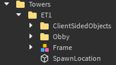

# Using the Kit

## Adding a tower

Adding a tower is at the core of this kit, It's pretty much the whole reason one would use this kit. To add a tower, start by inserting a tower, or even a blank kit, into the workspace. After it is inserted, move it into the `Towers` folder.

Rename the tower to the acronym of the tower; Be reasonable, as it's acronym will be used as the tower's internal identifier, and will be shown next to the timer on the client's GUI.

The tower should be organized the same way any tower is normally organized. The kit folder should contain:

- The `Obby` folder which contains all of the normal, static parts. Most of which make up the gameplay of the tower.
- The `Frame` folder/model, which contains the parts that make up the frame of the tower. This functionally is exactly the same as the obby folder, but a distinction will be important in the future, as I plan on adding a low-detail mode[^1] to the kit in the future.
- The `ClientSidedObjects` folder contains all of the client objects for the tower. When the game loads, every tower’s `ClientSidedObjects` folder is moved into storage (`game.ServerStorage.TowerClientObjects`), and is served to a client whenever they load a tower.
  - Optionally, you may move this folder to the `TowerClientObjects` folder yourself in studio, just as long as the folder is renamed to be the same as the tower’s acronym.
  - The folder itself is optional too, the kit will function if this folder is removed completely, making it a true **“purist”**[^2] tower.

:::info

In this image, an example tower is shown appropriately inserted into the `Towers` folder. Because this tower is called "**Example Tower 1**", the folder is named after it's acronym, "**ET1**".

:::

After inserting the tower into the place, you must give it some properties to make it work with the MTK. Properties may be inserted in 2 ways: The first being adding an attribute to the tower folder, the second being adding a ValueBase (`BoolValue`, `StringValue`, `NumberValue`, etc) instance to the folder. For convenience sake, **ValueBases** are used by default in the kit. Here are the following properties that must be added to the tower folder:

- A **BadgeID** `IntValue`. When the tower is beaten by the player, they will be awarded a badge, the value of this property being the ID of the badge awarded. If the value is 0, no badge will be awarded.
- A **Difficulty** `StringValue`. This will point to a difficulty defined in the Difficulties[^3] module. If it does not name an existing difficulty, a `default` difficulty will be used, which is heavily discouraged. Difficulties are explain further in [here](./Configuration.md#configuring-difficulties).
  - For now, any built-in difficulty works, those being: Impossible, Easy, Medium, Hard, Difficult, Challenging, Intense, Remorseless, Insane, Extreme, Terrifying, Catastrophic, Horrific, and Unreal.
- A **MinimumTime** `NumberValue`. This property describes how much time (in seconds) a player must be in a tower for a completion to be considered legitimate. If the tower is beaten before the timer passes this value, the player will be kicked for cheating.
- A **ProperName** `StringValue`. This property describes the proper name of the tower, as the name of the folder is merely the acronym. The proper name is usually used for win messages. For example: If i had a tower folder named `ToS`, a reasonable value for this property would be `Tower of Stress`.

This image depicts the folder structure of Example Tower 1 as shown earlier, but with the new properties added.

At this point, the tower has been fully implemented. It just needs a portal to be entered.

## Creating portals

Portals are the parts that load a tower when a player touches it, as well as teleporting them to the tower’s `SpawnLocation`. All portal parts must be put in the `Portals` folder in the `workspace` to work.

To create a portal, start by inserting a `BasePart` into the `Portals` folder. Then, add a `StringValue` to the portal part named `TowerPortal`. Alternatively, you can duplicate any of the portals included with the template place. Set the value of the `TowerPortal` string to the acronym of any tower, more accurately, the name of any folder in the `Towers` folder.

A bare minimum setup of the `Portals` folder, including 3 portals.

:::note

The parts in the folder does not actually matter.

:::

You can also choose to instead give a `TowerPortal` a `StringValue` named `LobbyTeleporter`. This will turn it into a server-sided teleporter. Set it’s value to the name of any part in the `Markers` folder, and touching it in-game will teleport the player to that marker.

## Adding anti-cheat checkpoints to a tower

Anti-cheat checkpoints are a new feature to the MTK that acts similarly to the checkpoints in JToH. They are invisible blocks never seen by the client, and the character must pass through them in order. Failure to do so will result in the player being kicked for completing the tower out of order.

:::info

Every tower’s checkpoints can be defined as a list of parts.

:::

This list is constructed from a folder, either `Checkpoints` inside the tower folder itself, or a folder named the same as the tower acronym inside the `TowerCheckpoints` folder inside `ServerStorage`.

:::warning

If the checkpoints folder is kept in the tower folder, you will be warned for doing so, as leaving anything in the workspace is at risk of being obtained by exploiters, with checkpoints being too important to be made easily visible. Therefore, keeping them stored inside of `ServerStorage` is much safer, as it’s secure, and never has a chance of replicating to the client.

:::

:::danger

Every instance inside of the checkpoints folder must be named in order, with the very first checkpoint being named `1`, the second being named `2`, the third being named `3`, etc. Failure to do so will result in an error. Every instance must be also [BasePart](https://create.roblox.com/docs/reference/engine/classes/BasePart).

:::

The checkpoints folder as found in `ServerStorage`. ET2's checkpoints folder is expanded to show the parts inside it.

At the moment, checkpoint touch detection works by seeing if the character’s [pivot point](https://create.roblox.com/docs/studio/pivot-tools) is inside the _oriented bounding-box_ area of the part. This means that you can position and rotate the part as much as you want, but it will be treated like a box, regardless of it’s actual shape.

:::tip

Make sure the checkpoint parts are reasonably large, as the kit will only check if a player is inside a checkpoint every `0.25 seconds`. This rate can be changed in the `GameData.Config` module, specifically the `CheckpointInterval` property.

:::

## Building the lobby and setting up markers

Probably one of the most crucial part of your player’s experience is not just the towers, but the place the towers sit in itself. There’s not much important information to list in regards to building the lobby in this manual as that’s mostly going to be your responsibility. However there are some important things to consider:

- Keep things properly organized. There’s a folder in the `workspace` called `Lobby`, and anything related to the lobby should ideally be kept in this folder.
- Avoid use of physics constraints on the server-side. Any constraints, or special objects of any kind for that matter, should be made into client objects. Lobby COs are discussed further in [here](./Configuration.md#ever-present-client-objects).

Aside from this, there’s the markers folder which is useful for placing markers of different kinds around the map. This includes spawn points, teleporter portal destinations, etc. To create a marker, simply create a part in the `Markers` folder, and name whatever you wish. Naming markers certain things will give it special functionality, a list of markers and their functions are listed below:

- **SpawnLocation** is a SpawnLocation part that acts as the default spawn, and should ideally be where all players in the `Start` team spawn.
- **WinroomSpawn** is also a SpawnLocation, but is specifically attributed to the `Winners` team. It’s also where all win pads will teleport the player by default unless specified otherwise.
- **LobbyTP** is a server-sided teleporter part. When a player touches it, they will be teleported to the `Start` team’s SpawnLocation, and will be re-assigned to the `Start` team if they aren’t a member already. This should ideally be used in sky lobbies and winrooms.

Any marker without a name listed above doesn’t get any special functionality. They will just be plain parts that don’t do anything on their own. The reason you would need to create parts like these is usually to act as destinations for teleporters. Lobby portals will search the `Markers` folder for a part named the value of it’s `LobbyTeleporter` value. Win pads on the other hand can be optionally configured to teleport to a marker of a specific name instead of the `WinroomSpawn`.

[^1]: Low-Detail Mode (LDM) is a feature in Juke’s Towers of Hell where the Obby folder’s contents of every tower are hidden, unless that tower is being played. However, the frame folder will be left untouched. The point of this feature is to put less stress on lower-end devices by having less things onscreen for the device to render.
[^2]: Although sometimes the definition is stretched to allow for purely cosmetic client objects, the MTK defines "purist" towers as having no client objects at all.
[^3]: This module is located in `game.ServerScriptService.GameData.Difficulties`.
